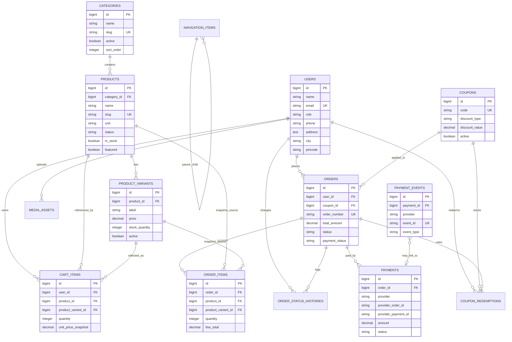

# Laravel Database Design

Source: `PROJECT_ANALYSIS.md`  
Target backend: Laravel 12  
Scope: database migrations, ER diagram, Eloquent relationships, foreign keys, and indexes. Controllers are intentionally excluded.

## Design Principles

- Laravel owns all trusted business data: products, prices, cart, checkout, orders, payments, coupons, CMS, uploads, and users.
- Money is stored as decimal columns, never floats.
- Checkout recalculates totals from server-side product variants, not from frontend cart snapshots.
- Orders and order items store snapshots so historical invoices remain stable if product names, images, or prices later change.
- Payment creation, verification, and webhook events are persisted for reconciliation.
- CMS tables preserve the current Base44 content model while using Laravel-friendly table names and indexes.
- Secrets should not be exposed in public CMS responses. Payment and email secrets should live in `.env` or encrypted settings.

## Migration Order

Use this order so foreign keys can be created cleanly.

1. Existing Laravel tables:
   - `0001_01_01_000000_create_users_table.php`
   - `0001_01_01_000001_create_cache_table.php`
   - `0001_01_01_000002_create_jobs_table.php`
2. `2026_07_06_000100_alter_users_add_profile_and_role.php`
3. `2026_07_06_000200_create_catalog_tables.php`
4. `2026_07_06_000300_create_cart_tables.php`
5. `2026_07_06_000400_create_coupon_tables.php`
6. `2026_07_06_000500_create_order_tables.php`
7. `2026_07_06_000600_create_payment_tables.php`
8. `2026_07_06_000700_create_cms_tables.php`
9. `2026_07_06_000800_create_communication_tables.php`
10. `2026_07_06_000900_create_media_assets_table.php`
11. `2026_07_06_001000_create_import_audit_tables.php`

## ER Diagram



## Migration Details

### 1. Alter Users

Migration: `2026_07_06_000100_alter_users_add_profile_and_role.php`

```php
Schema::table('users', function (Blueprint $table) {
    $table->string('role', 30)->default('customer')->after('password');
    $table->string('phone', 30)->nullable()->after('role');
    $table->text('address')->nullable()->after('phone');
    $table->string('city', 120)->nullable()->after('address');
    $table->string('pincode', 20)->nullable()->after('city');
    $table->timestamp('last_login_at')->nullable()->after('remember_token');

    $table->index('role');
    $table->index('phone');
});
```

Relationships:

- `User hasMany CartItem`
- `User hasMany Order`
- `User hasMany CouponRedemption`
- `User hasMany MediaAsset`

### 2. Catalog Tables

Migration: `2026_07_06_000200_create_catalog_tables.php`

#### `categories`

```php
Schema::create('categories', function (Blueprint $table) {
    $table->id();
    $table->string('name');
    $table->string('slug')->unique();
    $table->text('description')->nullable();
    $table->string('image_url')->nullable();
    $table->unsignedInteger('sort_order')->default(0);
    $table->boolean('active')->default(true);
    $table->timestamps();

    $table->index(['active', 'sort_order']);
});
```

#### `products`

```php
Schema::create('products', function (Blueprint $table) {
    $table->id();
    $table->foreignId('category_id')->nullable()->constrained()->nullOnDelete();
    $table->string('name');
    $table->string('slug')->unique();
    $table->longText('description')->nullable();
    $table->string('image_url')->nullable();
    $table->string('promo_video_url')->nullable();
    $table->string('unit', 20)->default('kg');
    $table->string('status', 20)->default('active');
    $table->boolean('in_stock')->default(true);
    $table->boolean('featured')->default(false);
    $table->boolean('featured_in_footer')->default(false);
    $table->boolean('show_category_badge')->default(true);
    $table->unsignedInteger('display_order')->default(0);
    $table->unsignedInteger('signature_display_order')->default(0);
    $table->text('ingredients')->nullable();
    $table->text('keywords')->nullable();
    $table->timestamps();
    $table->softDeletes();

    $table->index(['status', 'display_order']);
    $table->index(['featured', 'signature_display_order']);
    $table->index(['featured_in_footer']);
    $table->index(['category_id', 'status']);
});
```

#### `product_variants`

```php
Schema::create('product_variants', function (Blueprint $table) {
    $table->id();
    $table->foreignId('product_id')->constrained()->cascadeOnDelete();
    $table->string('label', 80);
    $table->string('unit', 20);
    $table->decimal('quantity_value', 10, 3);
    $table->string('quantity_unit', 20);
    $table->decimal('price', 12, 2);
    $table->decimal('compare_at_price', 12, 2)->nullable();
    $table->string('sku')->nullable()->unique();
    $table->unsignedInteger('stock_quantity')->nullable();
    $table->boolean('active')->default(true);
    $table->unsignedInteger('sort_order')->default(0);
    $table->timestamps();
    $table->softDeletes();

    $table->unique(['product_id', 'label']);
    $table->index(['product_id', 'active', 'sort_order']);
});
```

Notes:

- Base44 product columns such as `price_250g`, `price_500g`, `price_per_kg`, `price_200ml`, `price_500ml`, and `price_1000ml` should be imported as rows in `product_variants`.
- Example labels: `250g`, `500g`, `1kg`, `200ml`, `500ml`, `1000ml`.

Relationships:

- `Category hasMany Product`
- `Product belongsTo Category`
- `Product hasMany ProductVariant`
- `ProductVariant belongsTo Product`

### 3. Cart Tables

Migration: `2026_07_06_000300_create_cart_tables.php`

#### `cart_items`

```php
Schema::create('cart_items', function (Blueprint $table) {
    $table->id();
    $table->foreignId('user_id')->constrained()->cascadeOnDelete();
    $table->foreignId('product_id')->constrained()->cascadeOnDelete();
    $table->foreignId('product_variant_id')->nullable()->constrained()->nullOnDelete();
    $table->unsignedInteger('quantity')->default(1);
    $table->decimal('unit_price_snapshot', 12, 2);
    $table->string('product_name_snapshot');
    $table->string('product_image_snapshot')->nullable();
    $table->string('variant_label_snapshot', 80)->nullable();
    $table->timestamps();

    $table->unique(['user_id', 'product_id', 'product_variant_id'], 'cart_unique_user_product_variant');
    $table->index('user_id');
    $table->index(['product_id', 'product_variant_id']);
});
```

Relationships:

- `CartItem belongsTo User`
- `CartItem belongsTo Product`
- `CartItem belongsTo ProductVariant`

### 4. Coupon Tables

Migration: `2026_07_06_000400_create_coupon_tables.php`

#### `coupons`

```php
Schema::create('coupons', function (Blueprint $table) {
    $table->id();
    $table->string('code')->unique();
    $table->text('description')->nullable();
    $table->string('discount_type', 20);
    $table->decimal('discount_value', 12, 2);
    $table->decimal('min_order_value', 12, 2)->default(0);
    $table->decimal('max_discount', 12, 2)->nullable();
    $table->date('valid_from')->nullable();
    $table->date('valid_until')->nullable();
    $table->unsignedInteger('usage_limit')->nullable();
    $table->unsignedInteger('used_count')->default(0);
    $table->boolean('active')->default(true);
    $table->timestamps();

    $table->index(['active', 'valid_from', 'valid_until']);
    $table->index('discount_type');
});
```

#### `coupon_redemptions`

```php
Schema::create('coupon_redemptions', function (Blueprint $table) {
    $table->id();
    $table->foreignId('coupon_id')->constrained()->cascadeOnDelete();
    $table->foreignId('user_id')->nullable()->constrained()->nullOnDelete();
    $table->foreignId('order_id')->nullable()->constrained()->nullOnDelete();
    $table->decimal('discount_amount', 12, 2);
    $table->timestamps();

    $table->unique(['coupon_id', 'order_id']);
    $table->index(['coupon_id', 'user_id']);
});
```

Relationships:

- `Coupon hasMany CouponRedemption`
- `Coupon hasMany Order`
- `CouponRedemption belongsTo Coupon`
- `CouponRedemption belongsTo User`
- `CouponRedemption belongsTo Order`

### 5. Order Tables

Migration: `2026_07_06_000500_create_order_tables.php`

#### `orders`

```php
Schema::create('orders', function (Blueprint $table) {
    $table->id();
    $table->foreignId('user_id')->nullable()->constrained()->nullOnDelete();
    $table->foreignId('coupon_id')->nullable()->constrained()->nullOnDelete();
    $table->string('order_number')->unique();
    $table->string('customer_name');
    $table->string('customer_email')->nullable();
    $table->string('customer_phone', 30);
    $table->text('delivery_address');
    $table->decimal('subtotal', 12, 2)->default(0);
    $table->decimal('discount_total', 12, 2)->default(0);
    $table->decimal('shipping_total', 12, 2)->default(0);
    $table->decimal('tax_total', 12, 2)->default(0);
    $table->decimal('total_amount', 12, 2)->default(0);
    $table->string('coupon_code')->nullable();
    $table->string('status', 30)->default('pending');
    $table->string('payment_status', 30)->default('pending');
    $table->timestamp('order_date')->nullable();
    $table->string('tracking_id')->nullable();
    $table->text('notes')->nullable();
    $table->timestamps();
    $table->softDeletes();

    $table->index('user_id');
    $table->index('coupon_id');
    $table->index('customer_phone');
    $table->index(['status', 'created_at']);
    $table->index(['payment_status', 'created_at']);
    $table->index('order_date');
});
```

#### `order_items`

```php
Schema::create('order_items', function (Blueprint $table) {
    $table->id();
    $table->foreignId('order_id')->constrained()->cascadeOnDelete();
    $table->foreignId('product_id')->nullable()->constrained()->nullOnDelete();
    $table->foreignId('product_variant_id')->nullable()->constrained()->nullOnDelete();
    $table->string('product_name');
    $table->string('product_image')->nullable();
    $table->string('variant_label', 80)->nullable();
    $table->string('unit', 20)->nullable();
    $table->string('weight', 40)->nullable();
    $table->unsignedInteger('quantity');
    $table->decimal('unit_price', 12, 2);
    $table->decimal('line_total', 12, 2);
    $table->timestamps();

    $table->index('order_id');
    $table->index('product_id');
    $table->index('product_variant_id');
});
```

#### `order_status_histories`

```php
Schema::create('order_status_histories', function (Blueprint $table) {
    $table->id();
    $table->foreignId('order_id')->constrained()->cascadeOnDelete();
    $table->string('old_status', 30)->nullable();
    $table->string('new_status', 30);
    $table->foreignId('changed_by_user_id')->nullable()->constrained('users')->nullOnDelete();
    $table->text('note')->nullable();
    $table->timestamps();

    $table->index(['order_id', 'created_at']);
    $table->index('changed_by_user_id');
});
```

Relationships:

- `Order belongsTo User`
- `Order belongsTo Coupon`
- `Order hasMany OrderItem`
- `Order hasMany Payment`
- `Order hasMany OrderStatusHistory`
- `Order hasOne CouponRedemption`
- `OrderItem belongsTo Order`
- `OrderItem belongsTo Product`
- `OrderItem belongsTo ProductVariant`
- `OrderStatusHistory belongsTo Order`
- `OrderStatusHistory belongsTo User as changedBy`

### 6. Payment Tables

Migration: `2026_07_06_000600_create_payment_tables.php`

#### `payments`

```php
Schema::create('payments', function (Blueprint $table) {
    $table->id();
    $table->foreignId('order_id')->constrained()->cascadeOnDelete();
    $table->string('provider', 30)->default('razorpay');
    $table->string('provider_order_id')->nullable();
    $table->string('provider_payment_id')->nullable();
    $table->string('provider_signature')->nullable();
    $table->decimal('amount', 12, 2);
    $table->string('currency', 10)->default('INR');
    $table->string('status', 30)->default('created');
    $table->json('raw_payload')->nullable();
    $table->timestamp('verified_at')->nullable();
    $table->timestamps();

    $table->index('order_id');
    $table->index(['provider', 'status']);
    $table->unique(['provider', 'provider_order_id'], 'payments_provider_order_unique');
    $table->unique(['provider', 'provider_payment_id'], 'payments_provider_payment_unique');
});
```

#### `payment_events`

```php
Schema::create('payment_events', function (Blueprint $table) {
    $table->id();
    $table->foreignId('payment_id')->nullable()->constrained()->nullOnDelete();
    $table->string('provider', 30)->default('razorpay');
    $table->string('event_id')->nullable();
    $table->string('event_type');
    $table->json('payload');
    $table->timestamp('processed_at')->nullable();
    $table->timestamps();

    $table->unique(['provider', 'event_id'], 'payment_events_provider_event_unique');
    $table->index(['provider', 'event_type']);
    $table->index('processed_at');
});
```

Relationships:

- `Payment belongsTo Order`
- `Payment hasMany PaymentEvent`
- `PaymentEvent belongsTo Payment`

### 7. CMS Tables

Migration: `2026_07_06_000700_create_cms_tables.php`

#### `site_settings`

```php
Schema::create('site_settings', function (Blueprint $table) {
    $table->id();
    $table->string('site_name');
    $table->string('tagline')->nullable();
    $table->string('logo')->nullable();
    $table->string('preloader_logo')->nullable();
    $table->string('favicon')->nullable();
    $table->string('about_banner')->nullable();
    $table->string('contact_banner')->nullable();
    $table->string('products_banner')->nullable();
    $table->string('phone', 30)->nullable();
    $table->string('whatsapp_number', 30)->nullable();
    $table->string('email')->nullable();
    $table->text('address')->nullable();
    $table->text('top_bar_text')->nullable();
    $table->text('footer_text')->nullable();
    $table->string('social_facebook')->nullable();
    $table->string('social_instagram')->nullable();
    $table->string('social_youtube')->nullable();
    $table->string('social_twitter')->nullable();
    $table->string('social_whatsapp')->nullable();
    $table->string('reviews_heading')->nullable();
    $table->timestamps();
});
```

#### `pages`

```php
Schema::create('pages', function (Blueprint $table) {
    $table->id();
    $table->string('page_key')->unique();
    $table->string('title');
    $table->string('banner_image')->nullable();
    $table->longText('content')->nullable();
    $table->string('content_heading')->nullable();
    $table->string('legacy_image')->nullable();
    $table->string('legacy_heading')->nullable();
    $table->longText('legacy_paragraph1')->nullable();
    $table->longText('legacy_paragraph2')->nullable();
    $table->json('sections')->nullable();
    $table->text('meta_description')->nullable();
    $table->boolean('active')->default(true);
    $table->timestamps();

    $table->index(['active', 'page_key']);
});
```

#### `banners`

```php
Schema::create('banners', function (Blueprint $table) {
    $table->id();
    $table->string('title');
    $table->string('subtitle')->nullable();
    $table->text('description')->nullable();
    $table->string('media_type', 20)->default('image');
    $table->string('image_url')->nullable();
    $table->string('video_url')->nullable();
    $table->string('link_url')->nullable();
    $table->string('button_text')->nullable();
    $table->boolean('active')->default(true);
    $table->unsignedInteger('sort_order')->default(0);
    $table->timestamps();

    $table->index(['active', 'sort_order']);
    $table->index('media_type');
});
```

#### `announcements`

```php
Schema::create('announcements', function (Blueprint $table) {
    $table->id();
    $table->text('text');
    $table->boolean('active')->default(true);
    $table->string('background_color', 20)->default('#C41E3A');
    $table->string('text_color', 20)->default('#FFFFFF');
    $table->unsignedInteger('scroll_speed')->default(50);
    $table->unsignedInteger('sort_order')->default(0);
    $table->timestamps();

    $table->index(['active', 'sort_order']);
});
```

#### `reviews`

```php
Schema::create('reviews', function (Blueprint $table) {
    $table->id();
    $table->string('customer_name');
    $table->string('customer_image')->nullable();
    $table->text('review_text');
    $table->unsignedTinyInteger('rating')->default(5);
    $table->boolean('active')->default(true);
    $table->unsignedInteger('sort_order')->default(0);
    $table->timestamps();

    $table->index(['active', 'sort_order']);
    $table->index('rating');
});
```

#### `navigation_items`

```php
Schema::create('navigation_items', function (Blueprint $table) {
    $table->id();
    $table->string('name');
    $table->string('path');
    $table->foreignId('parent_id')->nullable()->constrained('navigation_items')->nullOnDelete();
    $table->boolean('active')->default(true);
    $table->unsignedInteger('sort_order')->default(0);
    $table->timestamps();

    $table->index(['active', 'sort_order']);
    $table->index('parent_id');
});
```

#### `navbar_icons`

```php
Schema::create('navbar_icons', function (Blueprint $table) {
    $table->id();
    $table->string('name');
    $table->string('icon_type', 40);
    $table->string('url');
    $table->string('color', 20)->default('#000000');
    $table->boolean('active')->default(true);
    $table->unsignedInteger('sort_order')->default(0);
    $table->timestamps();

    $table->index(['active', 'sort_order']);
    $table->index('icon_type');
});
```

#### `footers`

```php
Schema::create('footers', function (Blueprint $table) {
    $table->id();
    $table->string('about_title')->nullable();
    $table->text('about_text')->nullable();
    $table->json('quick_links')->nullable();
    $table->text('contact_address')->nullable();
    $table->string('contact_phone', 30)->nullable();
    $table->string('contact_email')->nullable();
    $table->string('newsletter_title')->nullable();
    $table->text('newsletter_text')->nullable();
    $table->text('copyright_text')->nullable();
    $table->timestamps();
});
```

#### `about_stats`

```php
Schema::create('about_stats', function (Blueprint $table) {
    $table->id();
    $table->string('number');
    $table->string('label');
    $table->boolean('active')->default(true);
    $table->unsignedInteger('sort_order')->default(0);
    $table->timestamps();

    $table->index(['active', 'sort_order']);
});
```

#### `heritage_sections`

```php
Schema::create('heritage_sections', function (Blueprint $table) {
    $table->id();
    $table->string('title');
    $table->longText('description');
    $table->string('image_url')->nullable();
    $table->string('banner_image')->nullable();
    $table->string('video_url')->nullable();
    $table->string('button_text')->nullable();
    $table->string('button_link')->nullable();
    $table->boolean('active')->default(true);
    $table->timestamps();

    $table->index('active');
});
```

#### `palkova_sections`

```php
Schema::create('palkova_sections', function (Blueprint $table) {
    $table->id();
    $table->string('title');
    $table->string('subtitle')->nullable();
    $table->longText('description');
    $table->string('image_url')->nullable();
    $table->string('button_text')->nullable();
    $table->string('button_link')->nullable();
    $table->boolean('active')->default(true);
    $table->timestamps();

    $table->index('active');
});
```

#### `why_choose_us`

```php
Schema::create('why_choose_us', function (Blueprint $table) {
    $table->id();
    $table->string('heading')->nullable();
    $table->text('description')->nullable();
    $table->string('box1_title')->nullable();
    $table->text('box1_text')->nullable();
    $table->string('box2_title')->nullable();
    $table->text('box2_text')->nullable();
    $table->string('box3_title')->nullable();
    $table->text('box3_text')->nullable();
    $table->boolean('active')->default(true);
    $table->timestamps();

    $table->index('active');
});
```

#### `blogs`

```php
Schema::create('blogs', function (Blueprint $table) {
    $table->id();
    $table->string('title');
    $table->string('slug')->unique();
    $table->text('excerpt')->nullable();
    $table->longText('content');
    $table->string('featured_image')->nullable();
    $table->string('author')->nullable();
    $table->boolean('published')->default(false);
    $table->timestamp('publish_date')->nullable();
    $table->string('tags')->nullable();
    $table->timestamps();
    $table->softDeletes();

    $table->index(['published', 'publish_date']);
});
```

#### `settings`

```php
Schema::create('settings', function (Blueprint $table) {
    $table->id();
    $table->string('key')->unique();
    $table->text('value')->nullable();
    $table->string('category', 60);
    $table->text('description')->nullable();
    $table->timestamps();

    $table->index('category');
});
```

#### `app_configurations`

```php
Schema::create('app_configurations', function (Blueprint $table) {
    $table->id();
    $table->string('admin_email')->nullable();
    $table->string('payment_gateway', 30)->default('razorpay');
    $table->boolean('payment_enabled')->default(true);
    $table->boolean('email_enabled')->default(true);
    $table->json('encrypted_payment_config')->nullable();
    $table->json('encrypted_email_config')->nullable();
    $table->timestamps();

    $table->index('payment_gateway');
});
```

CMS relationship notes:

- Most CMS tables are standalone because the current frontend reads them as singletons or active ordered lists.
- `navigation_items.parent_id` is self-referential for dropdown navigation.
- `site_settings`, `footers`, and `app_configurations` are singleton-style tables; enforce this in application logic or use a `key` column if multiple profiles are later needed.

### 8. Communication Tables

Migration: `2026_07_06_000800_create_communication_tables.php`

#### `newsletter_subscriptions`

```php
Schema::create('newsletter_subscriptions', function (Blueprint $table) {
    $table->id();
    $table->string('email')->unique();
    $table->timestamp('subscribed_at')->nullable();
    $table->boolean('active')->default(true);
    $table->timestamps();

    $table->index(['active', 'subscribed_at']);
});
```

#### `contact_messages`

```php
Schema::create('contact_messages', function (Blueprint $table) {
    $table->id();
    $table->string('name');
    $table->string('email')->nullable();
    $table->string('phone', 30)->nullable();
    $table->string('subject')->nullable();
    $table->longText('message');
    $table->timestamp('handled_at')->nullable();
    $table->timestamps();

    $table->index('email');
    $table->index('phone');
    $table->index('handled_at');
});
```

### 9. Media Assets

Migration: `2026_07_06_000900_create_media_assets_table.php`

```php
Schema::create('media_assets', function (Blueprint $table) {
    $table->id();
    $table->string('disk')->default('public');
    $table->string('path');
    $table->string('url')->nullable();
    $table->string('mime_type')->nullable();
    $table->unsignedBigInteger('size')->nullable();
    $table->foreignId('uploaded_by_user_id')->nullable()->constrained('users')->nullOnDelete();
    $table->nullableMorphs('entity');
    $table->timestamps();

    $table->unique(['disk', 'path']);
    $table->index('uploaded_by_user_id');
    $table->index('mime_type');
});
```

Relationships:

- `MediaAsset belongsTo User as uploadedBy`
- `MediaAsset morphTo entity`
- Product/CMS models may `morphMany MediaAsset`

### 10. Import Audit Tables

Migration: `2026_07_06_001000_create_import_audit_tables.php`

#### `base44_import_runs`

```php
Schema::create('base44_import_runs', function (Blueprint $table) {
    $table->id();
    $table->string('source_directory');
    $table->string('status', 30)->default('pending');
    $table->unsignedInteger('total_rows')->default(0);
    $table->unsignedInteger('imported_rows')->default(0);
    $table->unsignedInteger('failed_rows')->default(0);
    $table->json('summary')->nullable();
    $table->timestamp('started_at')->nullable();
    $table->timestamp('finished_at')->nullable();
    $table->timestamps();

    $table->index('status');
});
```

#### `base44_import_row_errors`

```php
Schema::create('base44_import_row_errors', function (Blueprint $table) {
    $table->id();
    $table->foreignId('base44_import_run_id')->constrained()->cascadeOnDelete();
    $table->string('source_file');
    $table->unsignedInteger('row_number')->nullable();
    $table->text('error_message');
    $table->json('row_payload')->nullable();
    $table->timestamps();

    $table->index(['base44_import_run_id', 'source_file']);
});
```

## Complete Relationship Map

### User

- `hasMany(CartItem::class)`
- `hasMany(Order::class)`
- `hasMany(CouponRedemption::class)`
- `hasMany(MediaAsset::class, 'uploaded_by_user_id')`
- `hasMany(OrderStatusHistory::class, 'changed_by_user_id')`

### Category

- `hasMany(Product::class)`

### Product

- `belongsTo(Category::class)`
- `hasMany(ProductVariant::class)`
- `hasMany(CartItem::class)`
- `hasMany(OrderItem::class)`
- `morphMany(MediaAsset::class, 'entity')`

### ProductVariant

- `belongsTo(Product::class)`
- `hasMany(CartItem::class)`
- `hasMany(OrderItem::class)`

### CartItem

- `belongsTo(User::class)`
- `belongsTo(Product::class)`
- `belongsTo(ProductVariant::class)`

### Coupon

- `hasMany(Order::class)`
- `hasMany(CouponRedemption::class)`

### CouponRedemption

- `belongsTo(Coupon::class)`
- `belongsTo(User::class)`
- `belongsTo(Order::class)`

### Order

- `belongsTo(User::class)`
- `belongsTo(Coupon::class)`
- `hasMany(OrderItem::class)`
- `hasMany(Payment::class)`
- `hasMany(OrderStatusHistory::class)`
- `hasOne(CouponRedemption::class)`

### OrderItem

- `belongsTo(Order::class)`
- `belongsTo(Product::class)`
- `belongsTo(ProductVariant::class)`

### OrderStatusHistory

- `belongsTo(Order::class)`
- `belongsTo(User::class, 'changed_by_user_id')`

### Payment

- `belongsTo(Order::class)`
- `hasMany(PaymentEvent::class)`

### PaymentEvent

- `belongsTo(Payment::class)`

### NavigationItem

- `belongsTo(NavigationItem::class, 'parent_id')`
- `hasMany(NavigationItem::class, 'parent_id')`

### MediaAsset

- `belongsTo(User::class, 'uploaded_by_user_id')`
- `morphTo('entity')`

## Foreign Key Summary

| Table | Column | References | On Delete |
| --- | --- | --- | --- |
| products | category_id | categories.id | SET NULL |
| product_variants | product_id | products.id | CASCADE |
| cart_items | user_id | users.id | CASCADE |
| cart_items | product_id | products.id | CASCADE |
| cart_items | product_variant_id | product_variants.id | SET NULL |
| coupon_redemptions | coupon_id | coupons.id | CASCADE |
| coupon_redemptions | user_id | users.id | SET NULL |
| coupon_redemptions | order_id | orders.id | SET NULL |
| orders | user_id | users.id | SET NULL |
| orders | coupon_id | coupons.id | SET NULL |
| order_items | order_id | orders.id | CASCADE |
| order_items | product_id | products.id | SET NULL |
| order_items | product_variant_id | product_variants.id | SET NULL |
| order_status_histories | order_id | orders.id | CASCADE |
| order_status_histories | changed_by_user_id | users.id | SET NULL |
| payments | order_id | orders.id | CASCADE |
| payment_events | payment_id | payments.id | SET NULL |
| navigation_items | parent_id | navigation_items.id | SET NULL |
| media_assets | uploaded_by_user_id | users.id | SET NULL |
| base44_import_row_errors | base44_import_run_id | base44_import_runs.id | CASCADE |

## Index Summary

High-value lookup indexes:

- `users.email` unique for login.
- `users.role` for admin filtering.
- `categories.slug` unique for public category routes.
- `categories(active, sort_order)` for category grid.
- `products.slug` unique for SEO-friendly product routes.
- `products(status, display_order)` for product listing.
- `products(featured, signature_display_order)` for homepage signature products.
- `products(category_id, status)` for filtered category listing.
- `product_variants(product_id, active, sort_order)` for detail page variant loading.
- `cart_items(user_id)` and unique `cart_items(user_id, product_id, product_variant_id)` for cart merge.
- `coupons.code` unique for coupon validation.
- `coupons(active, valid_from, valid_until)` for active coupon checks.
- `orders.order_number` unique for customer tracking.
- `orders(user_id)` for My Orders.
- `orders(status, created_at)` for admin order queue.
- `orders(payment_status, created_at)` for payment reconciliation.
- `order_items(order_id)` for order detail.
- `payments(provider, provider_order_id)` unique for Razorpay order reconciliation.
- `payments(provider, provider_payment_id)` unique for Razorpay payment reconciliation.
- `payment_events(provider, event_id)` unique for webhook idempotency.
- `pages.page_key` unique for CMS page loading.
- `banners(active, sort_order)` for hero carousel.
- `announcements(active, sort_order)` for announcement bar.
- `reviews(active, sort_order)` for reviews section.
- `navigation_items(active, sort_order)` and `navigation_items.parent_id` for nav rendering.
- `navbar_icons(active, sort_order)` for sticky social nav.
- `newsletter_subscriptions.email` unique for duplicate prevention.
- `media_assets(disk, path)` unique for file tracking.

## Enum Values to Enforce in Validation

Laravel can enforce these through form requests, model casts, or PHP enums. Database `enum` columns are optional; string columns are easier to evolve.

- `users.role`: `customer`, `admin`
- `products.unit`: `kg`, `ml`, `piece`, `box`
- `products.status`: `active`, `inactive`
- `product_variants.quantity_unit`: `g`, `kg`, `ml`, `l`, `piece`, `box`
- `coupons.discount_type`: `percentage`, `fixed`
- `orders.status`: `pending`, `confirmed`, `preparing`, `out_for_delivery`, `delivered`, `cancelled`
- `orders.payment_status`: `pending`, `completed`, `failed`, `refunded`
- `payments.provider`: `razorpay`, `stripe`, `paypal`
- `payments.status`: `created`, `authorized`, `captured`, `failed`, `refunded`
- `banners.media_type`: `image`, `video`
- `app_configurations.payment_gateway`: `razorpay`, `stripe`, `paypal`, `none`

## Model Casts

Recommended casts:

- Boolean: `active`, `featured`, `featured_in_footer`, `show_category_badge`, `in_stock`, `published`, `payment_enabled`, `email_enabled`.
- Decimal: prices, totals, discount amounts.
- Integer: quantities, stock, sort orders, usage counts.
- Array: JSON columns such as `pages.sections`, `footers.quick_links`, `payments.raw_payload`, `payment_events.payload`, encrypted config fields, import summaries.
- Date/time: `valid_from`, `valid_until`, `order_date`, `verified_at`, `processed_at`, `publish_date`, `subscribed_at`, `handled_at`, import timestamps.

## Base44 Export Mapping

| Base44 Export | Laravel Table |
| --- | --- |
| Product_export.csv | products, product_variants |
| Category_export.csv | categories |
| CartItem_export.csv | cart_items, if historical carts should be preserved |
| Order_export.csv | orders, order_items, payments |
| Coupon_export.csv | coupons |
| Configuration_export.csv | app_configurations |
| SiteSettings_export.csv | site_settings |
| Footer_export.csv | footers |
| Page_export.csv | pages |
| Banner_export.csv | banners |
| Announcement_export.csv | announcements |
| Review_export.csv | reviews |
| Navigation_export.csv | navigation_items |
| NavbarIcon_export.csv | navbar_icons |
| AboutStat_export.csv | about_stats |
| Heritage_export.csv | heritage_sections |
| Palkova_export.csv | palkova_sections |
| WhyChooseUs_export.csv | why_choose_us |
| Blog_export.csv | blogs |
| NewsletterSubscription_export.csv | newsletter_subscriptions |
| Settings_export.csv | settings |
| ClientUser_export.csv | users, if populated later |

## Implementation Notes Before Writing Physical Migrations

- The current Laravel backend already has a default `users` migration. Add profile fields through an alter migration rather than editing the default migration if the database may already be migrated.
- If the app will use Laravel Sanctum, install Sanctum and include its migration before auth API work.
- Use transactions for checkout: create order, order items, coupon redemption, payment row, and cart clear as one consistent workflow where appropriate.
- Use `softDeletes()` for products, blogs, and orders so admin actions do not break historical records.
- Do not cascade-delete orders when users are deleted; keep order history with `user_id` set null.
- Do not cascade-delete order item product references; keep snapshots and set references null.
- Store Razorpay webhook payloads exactly as received in `payment_events.payload`.
- Keep `app_configurations.encrypted_*_config` hidden from API resources.

